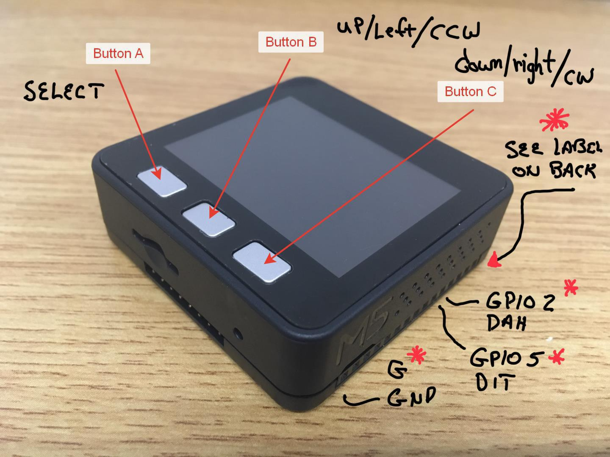

## Morse Tutor 2 On The ESP32 (Beta)

Conversion of Dr. Jack Purdum, W8TEE's Morse Code Tutor--Morse Tutor 2--
 
From: STM32F103 processor github [STMFMorseTutorSimplified-Community-007](https://github.com/TemporarilyOffline/MorseCodeTutor)

To: ESP32 Processor / M5Stack (ESP32 Core) Hardware [M5Stack Core](https://m5stack.com) / Arduino IDE

***
Detailed Arduino IDE setup instructions to build and deploy to the M5Stack hardware:
  
  [Windows](https://docs.m5stack.com/#/en/quick_start/m5core/m5stack_core_get_started_Arduino_Windows)  

[MAC](https://docs.m5stack.com/#/en/quick_start/m5core/m5stack_core_get_started_Arduino_MacOS)

Be sure to install the M5Stack Library in Step 4. This is the only dependency.
No third party libraries are required.
***

Major Conversion Tasks Completed
- Convert source syntax for Espressif ESP32 build tools  
- Change UI from rotary encoder/switch to M5Stack's three buttons (see diagram)
- Convert graphics for M5Stack's LCD Graphics Library
- Convert Morse Code tones from square wave to sine wave for M5Stack's on-board speaker  
- Add volume control to menu  
- Change from EEPROM library to Espressif NVS(Non-Volatile Storage) API

***  
TODO   
- Compare with the original project's functionality.  
- The maximum speed is a little over 30 Words Per Minute. Beyond that the on-board audio amplifier filters the short (dit) tone bursts.
The DAC2 audio is available to drive an external amplifier with a better response. 
A menu item should be added to turn off the internal speaker.  
- Verification of the code speed with the PARIS test.  
- Complete checkout before release.

***

bobolink
twitter: @wm6h

WEB: [DSP Objects](https://dspobjects.com)

___
**Interface Diagram**

